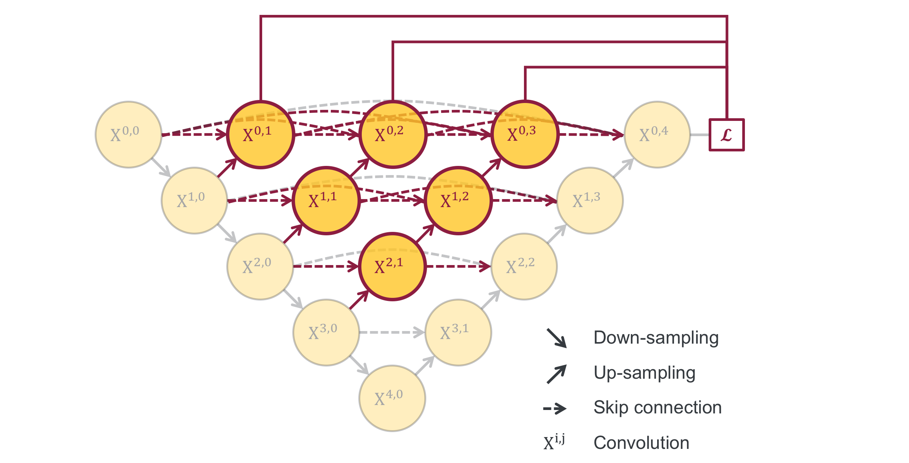

# unet-app-pucp

Revisión y aplicación de una red U-Net y su evolción a U-Net++

### [U-Net: Convolutional Networks for Biomedical Image Segmentation (2015)](https://arxiv.org/abs/1505.04597v1)

La U-Net es una de las famosas Fully Convolutional Networks (FCN) en segmentación de imágenes biomédicas, la cual fue publicada en 2015. 
La anotación de imágenes biomédicas, siempre se necesita expertos que hayan adquirido los conocimientos relacionados, considerando que es un proceso manual y toma mucho tiempo.
Si el proceso de anotación de imágenes se realiza de manera automática, se logra un menor esfuerzo y se reduce el error por parte de los expertos, también se estaría reduciendo los costos.

Diagrama de Aquitecura de una red U-Net:


Para citar a esta arquitectura de red: 
```
@misc{ronneberger2015unet,
    title={U-Net: Convolutional Networks for Biomedical Image Segmentation},
    author={Olaf Ronneberger and Philipp Fischer and Thomas Brox},
    year={2015},
    eprint={1505.04597},
    archivePrefix={arXiv},
    primaryClass={cs.CV}
}
```
### [UNet++: Redesigning Skip Connections to Exploit Multiscale Features in Image Segmentation (2020)](https://arxiv.org/abs/1912.05074v2)

Evolución de U-Net a UNet ++. Cada nodo en el gráfico representa un bloque de convolución, la dirección de las flechas indican en qué dirección se realiza el el muestreo y las flechas de puntos indican conexiones salteadas.

Diagrama de Aquitecura de una red U-Net:



Para citar a esta arquitectura de red: 
```
@misc{zhou2019unet,
    title={UNet++: Redesigning Skip Connections to Exploit Multiscale Features in Image Segmentation},
    author={Zongwei Zhou and Md Mahfuzur Rahman Siddiquee and Nima Tajbakhsh and Jianming Liang},
    year={2019},
    eprint={1912.05074},
    archivePrefix={arXiv},
    primaryClass={eess.IV}
}
```

### Descripción de Dataset

Para la presente aplicacón se está considerando el dataset de Hipocampo, el cual fue publicado en la [Medical Segmentation Decathlon](http://medicaldecathlon.com/)

